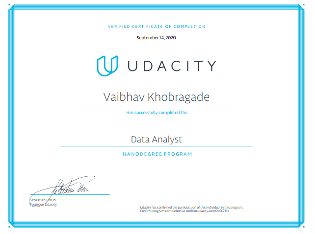

# NANGODEGREE PROGRAM
## Data Analyst
Learn to clean up messy data, uncover patterns and insights, make prediction using machine learning, and clearly communicate your findings.
[Verified Link](https://confirm.udacity.com/2LEC7J3Y)

## Core Curriculum
This section consists of all the lessons and projects you need to complete in order to receive your certificate.

## PART 5
## 5 PROJECTS

## PART 1
### Welcome to the Nanodegree program!
Welcome to the program! In this part, you’ll get an orientation into using our classroom and services. You’ll also get advice for making the best use of your time while enrolled in this program.

 * Project: Explore Weather Trends

## PART 2
### Introduction to Data Analysis
Learn the data analysis process of questioning, wrangling, exploring, analyzing, and communicating data. Learn how to work with data in Python using libraries like NumPy and Pandas.

 * [Project 2: Investigate a Dataset](https://github.com/codenigma1/Data-Analyst-Nanodegree/blob/master/2-Investigate-a-Dataset/investigate-a-dataset-template.ipynb)

## PART 3
### Practical Statistics
Learn how to apply inferential statistics and probability to important, real-world scenarios, such as analyzing A/B tests and building supervised learning models.

 * [Project 3: Analyze A/B Test Results](https://github.com/codenigma1/Data-Analyst-Nanodegree/blob/master/3-Analyze_AB_Test_Results/Analyze_ab_test_results_notebook.ipynb)

## PART 4
### Data Wrangling
Learn the data wrangling process of gathering, assessing, and cleaning data. Learn how to use Python to wrangle data programmatically and prepare it for deeper analysis.

 * [Project: Wrangle and Analyze Data](https://github.com/codenigma1/Data-Analyst-Nanodegree/blob/master/Project_4_Data_Wrangling/wrangle_act.ipynb)

## PART 5
### Data Visualization
Learn to apply sound design and data visualization principles to the data analysis process. Learn how to use analysis and visualizations to tell a story with data.

 * [Project: Communicate Data Findings](https://github.com/codenigma1/Data-Analyst-Nanodegree/blob/master/Project_5_Communication_Data_Finding/exploration_template.ipynb)
